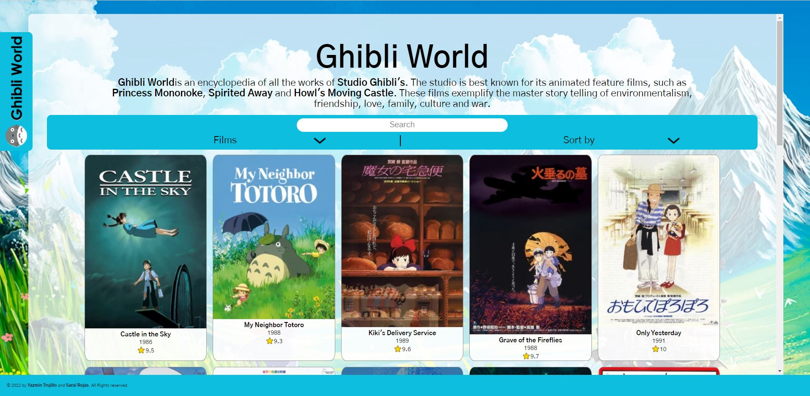
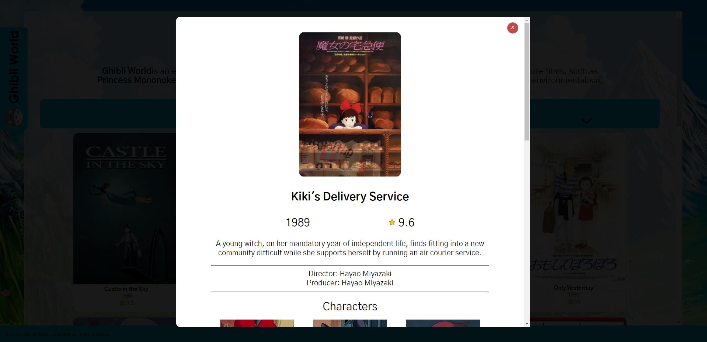

# Data Lovers

## Índice

- [1. Resumen del proyecto](#1-resumen-del-proyecto)
- [2. Imagenes proyecto finalizado](#2-Imagenes-proyecto-finalizado)
- [3. UX Research](#5-UX-research)

---

# 1. Resumen del proyecto

Este proyecto **consiste en una _página web_ para visualizar un
_conjunto (set) de datos_** de Studio Ghibli.

Esta página web permite visualizar las películas producidas por Studio Ghibli, así como personajes, locaciones y vehículos. Esta información puede ser ordenada alfabéticamente ( A-Z / Z-A) y en el caso de películas por fecha de estreno y puntaje. Tambien se puede filtrar la información mediante una barra de busqueda. Al seleccionar un elemento desplegado en pantalla se muestra un modal con información más detallada (Figura 4).

### Desarrollado con

- [HTML](https://developer.mozilla.org/en-US/docs/Glossary/HTML)
- [JavaScript](https://www.javascript.com/)
- [CSS](https://developer.mozilla.org/en-US/docs/Web/CSS)

# 2. Imagenes proyecto finalizado

<strong>Figura 1. </strong> Tamaño de dispositivo small devices (mobile)

 

     

<strong>Figura 2.</strong> Tamaño de dispositivo medium devices (tablets, 768px and up)

 

     

<strong>Figura 3.</strong> Tamaño de dispositivo Large devices (laptops/desktops, 992px and up)

 

     

<strong>Figura 4.</strong>Modal

 

# 3. UX research

Studio Ghibli es un estudio de animación japonés, conocido por sus largometrajes
animados como **Mi vecino Totoro**, **El viaje de Chihiro** o
**El castillo ambulante**, entre otros grandes éxitos.

Las animaciones tienen gran acogida a nivel mundial y algunas han recibido
varias nominaciones y premios. De todo este fandom hay un grupo que desea poder
interactuar y ver la información de las animaciones y sus personajes.

## Hallazgos

Para entender mejor qué información podrían necesitar nuestras usuarias,
hicimos una rápida investigación (research) y estos son algunos de los
hallazgos.

- Studio Ghibli tiene varias animaciones, para nuestras usuarias es importante
  saber cuántas y cuáles son.
- Las animaciones tienen directorxs y productorxs. Estxs son las mentes detrás
  de una gran animación. En Studio Ghibli hay directorxs y productorxs que han
  colaborado en la creación de más de una animación. Por ello, es importante
  para nuestra usuaria poder conocerlos y saber cuántas y cuáles son las
  animaciones a las que dieron "vida".
- Las animaciones tienen información relevante para nuestras usuarias, como
  descripción, fecha de lanzamiento, peso, director, productor y personajes.
- Cada animación tiene sus personajes, para nuestras usuarias es importante
  saber cuántos y cuáles son
- Los personajes tienen características únicas que la usuaria quiere saber, como
  nombre, edad, género, especie, etc.
- Las animaciones tienen locaciones y vehículos únicos en cada una. Para
  nuestras usuarias es importante saber cuáles son.
- Adicionalmente a esta información, para nuestras usuarias es importante poder
  ver los tipos de especies que hay en cada animación.

## Historia de usuario

Las historias de usuario de este proyecto se encuentan en el siguiente enlace: https://trello.com/b/KSyHngwu/project-2-data-lovers

## Prototipo de baja fidelidad

Se realizó un prototipo de baja fidelidad y alta fidelidal. Tambien se llevo acabo pruebas de usabilidad.

  

<strong>Figura 5.</strong> Prototipo de baja fidelidad

 

## Pruebas de usabilidad

Para la prueba de usabilidad del prototipo 1 se entrevisto a diez usuarias. Las preguntas realizadas fueron las siguientes:

1. ¿Consideraras que el diseño de la página facilita la busqueda de la información?
2. ¿Hay algun elemento dentro de la página que te cause confusion?
3. ¿Tienes algun otro comentario?

De las respuestas obtenidas se llegaron a las siguientes conclusiones

- En el prototipo se propone poner el nombre de la vista 'HOME'. Sin embargo, esto causa confusion sobre su significado.
- Las usuarias recomendaron evitar un exceso de espacio vacio en los costados de la página
- Se cuestiono si era relebante mostrar información sobre el staff que trabajo en la realización de las películas.

Aparte de los comentarios anteriores, durante en feedback en la ceremonia de demos se sugirió mostrar la información de una forma más directa, para que fuera lo primera que viera la usuaria al ingresar a la página.

Con base en los resultados de las pruebas de usabilidad y feedback se realizaron los siguientes cambios:

- Eliminar el 'HOME'
- No se dara la opción de filtar por staff, ya que aunado a los comentarios de las pruebas de usabilidad, la base de datos de Studio Ghibli no contiene datos suficientes para mostrar en pantalla.
- La información sera desplegada en la primera vista de la página, para permitir filtrarla se agregará formularios para filtrar y ordenar, además de una barra de busqueda para busquedas más puntuales.

## Prototipo de alta fidelidad

<strong>Figura 6.</strong> Prototipo movil

 

<strong>Figura 7.</strong> Prototipo tablet

 

<strong>Figura 8.</strong> Prototipo Desktop

 
